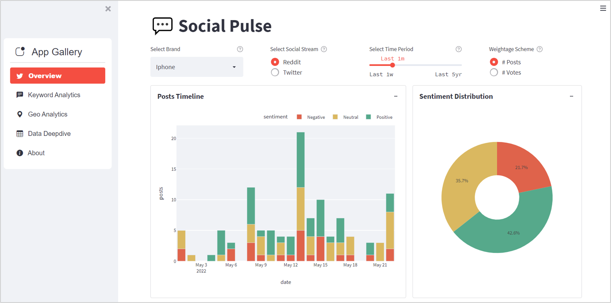
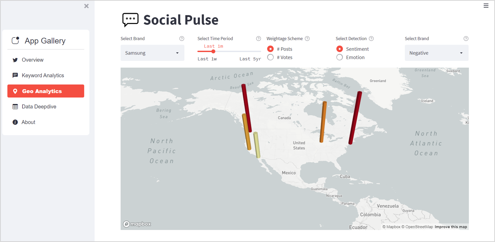

# Social Pulse - Understanding Brand Perception using Social Media Analytics

ECE229 (Spring 2022) Course Project by: Murali Dandu, Christopher Light, Hao Qiu, Liyang Ru, Pai Tong, Yen-Ju Tseng


## About

Listening to customers’ thoughts is one of the most important aspects for any brand growth. Social media analytics provides a powerful way to understand how they are perceiving your brand, industry and competitors. Here we are proposing 'Social Pulse', a platform for Brand Marketers based on statistical and ML text/NLP analytics.

This app analyzes the brand social media data in terms of sentiment, emotion, keywords and more!

## Installation

Here are the requirements for running this streamlit application.
```
htbuilder==0.6.0
imageio==2.19.3
matplotlib==3.3.4
networkx==2.8
nltk==3.7
numpy==1.20.0
pandas==1.4.2
plotly==5.8.0
pydeck==0.7.1
pyvis==0.2.1
scikit_learn==1.1.1
streamlit==1.9.0
streamlit_option_menu==0.3.2
wordcloud==1.8.1
```
As a recommended practice, you can create virtual environment and install the required packages in the following way
```
# Clone the repo
git clone https://github.com/murali-munna/social-pulse-nlp.git

# Create virtual env
conda create -n social_pulse python=3.8 

# Activate the virual env
conda activate social_pulse 

# cd into the root folder and install requirements
pip install requirements.txt
```
Run the app:
```
streamlit run streamlit_app/app.py
```


## User Story


A Brand Manager can ask and answer several questions like:
- How is my brand's sentiment over a specific time period?
- How is the user perception of the new features launched?
- What are the key-topics that users are talking about and how's their sentiment?
- How is the sentiment/perception varying across geographies and how can I allocate my budget and personnel accordingly?
- How are Twitter users different to Reddit and how can I perform targeting marketing based on that?
- How is my competitor brand performing?

## Data Extraction

**Twitter Data:** We scraped data of 10+ brands from relevant hashtags using [Tweepy](https://www.tweepy.org/). Note that the free API limits the data to download the last 1 week time period data using search terms. Twitter data contains geo-spatial information but usually has less context and more marketing information.

**Reddit Data:** We scraped data of 10+ brands from relevant sub-reddits and search terms using [PRAW](https://praw.readthedocs.io/en/stable/). Reddit provides options to scrape from 'Hot, New, Top' posts etc and usually has more content in brand discussions .

## Models

* **Sentiment Detection:** 'Twitter and Reddit Sentimental analysis Dataset' modelled to detect Positive, Neutral and Negative classes. We used LinearSVC model with TF-IDF representations.

* **Emotion Detection:** 'Emotions Dataset' modelled to detect five emotions: joy, sadness, surprise, anger, fear. We used LinearSVC model with TF-IDF representations.

**Keyword Extraction:**

- **YAKE:** We used YAKE method to extract sub-topics from the brand texts. It is an unsupervised keyword extraction method based on text statistical features. The topics returned are usually unigrams and are used to understand sentiment and emotion across the topics.
  
- **KeyBERT:** We used KeyBERT to extract keyphrases from the brand texts. Keyword extraction technique based on similarity between phrases (noun chunks) and document embeddings. The candidates given to the KeyBERT are SpaCy noun chunks and hence we get 3-4 gram keyphrases. These are used to represent co-occurence graph of key themes in the brand.

## Dashboard Visualizations

### Overview


### Keyword Analytics


### Geo Analytics


### Data Deepdive


## Application Architecture


## Documentation

Click the link below to be directed to our Sphinx documentation page:

https://murali-munna.github.io/social-pulse-nlp/

---


